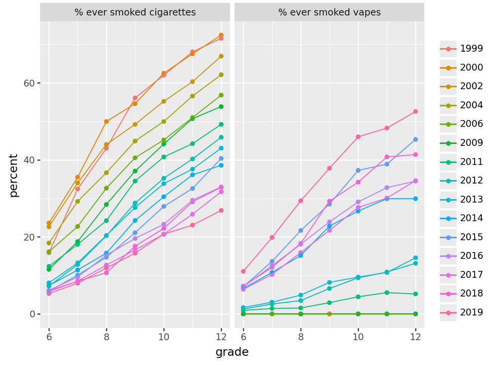

# Youth Tobacco Survey

This week, you will continue with the Youth Tobacco Survey
([data available here](https://www.cdc.gov/tobacco/about-data/surveys/historical-nyts-data-and-documentation.html)).

Here is a compiled dataset from all provided years: [yts_summarized.csv](data/yts_summarized.csv),
that contains the following variables for each combination of year, sex, and grade:

- `n`: sample size (i.e., number of students in this combination of age, sex, and year)
- `p_cig`: percent of students who report having ever tried a cigarette
- `p_vape`: percent of students who report having ever tried an e-cigarette
- `first_age`: mean reported age at which students first smoked, of those who have reported smoking
- `num_days`: mean number days on which smoked cigarettes of the past 30 days, of those who have reported smoking
- `p_will_smoke`: percent of students who say they will smoke a cigarette in the next year
- `p_harmful`: percent of students who say that they think the smoke from other people's cigarettes is harmful to them

Make exploratory plots of these data, including:

1. the percent of eigth-graders who report having tried a cigarette, across time, by reported sex
2. the same thing, for vapes
3. the mean reported age at which students first smoked in 2006, plotted against grade, with separate lines by sex
4. the mean reported age at which students first smoked in 2006, plotted against grade, with separate lines by year and facets by sex
5. the percentage who think they'll smoke in the next year against the percentage who think second-hand smoke is harmful,
    with one line per grade, and facets by sex

## Challenge: Make this plot

