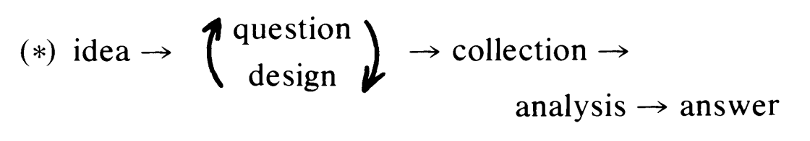
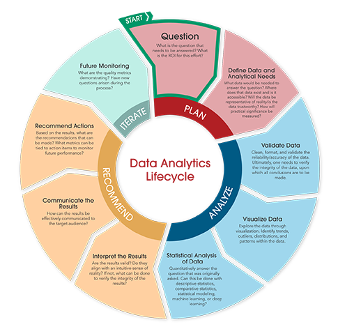

# Exploratory Data Analysis

Peter Ralph

https://uodsci.github.io/ds435

## Readings:

- Haig, *The Philosophy of Quantitative Methods*, ch.2, "Exploratory Data Analysis"
- Tan, Steinbach, and Kumar, *Introduction to Data Mining*, p.1-11 (the introduction)

## The data science life cycle

*Tukey 1980*

##

*image from [ADLM](https://myadlm.org/science-and-research/data-analytics-in-laboratory-medicine/what-is-data-analytics)*

## Discussion

- What are Haig's main points?
- What are the main points of Tan, Steinbach, and Kumar?
- Contrast "exploratory" and "confirmatory" data analysis.
- What points resonate with you? Which do not? Critiques?
