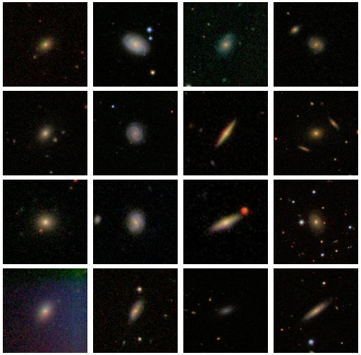

# The Galaxy Zoo

[galaxyzoo.org](https://galaxyzoo.org)

> For more than 15 years, we've asked volunteers to help us explore galaxies near and far, sampling a fraction of the roughly one hundred billion that are scattered throughout the observable Universe. Each one of the systems, containing billions of stars, has had a unique life, interacting with its surroundings and with other galaxies in many different ways; the aim of the Galaxy Zoo team is to try and understand these processes, and to work out what galaxies can tell us about the past, present and future of the Universe as a whole. 

::: caption
next slide from [NASA/ESA/CSA James Webb Space Telescope](https://esawebb.org/images/potm2504a/)
:::

## {background-image="resources/potm2504a.jpg" background-size="cover"}

## The Galaxy Zoo 1

https://data.galaxyzoo.org/

> The original Galaxy Zoo project ran from July 2007 until February 2009. It was replaced by Galaxy Zoo 2, Galaxy Zoo: Hubble, and Galaxy Zoo: CANDELS. In the original Galaxy Zoo project, volunteers classified images of Sloan Digital Sky Survey galaxies as belonging to one of six categories - elliptical, clockwise spiral, anticlockwise spiral, edge-on , star/don't know, or merger.  

## Data

::: columns
:::::: {.column width=50%}

- nearly 900,000 images, each centered on a galaxy
- each 424 x 424 (color) JPEG
- I'm looking at only 5,000 of those images
- ... which is 2,696,640,000 values

**Goals**:

- describe the color distribution among galaxies
- see what PCA gives us

::::::
:::::: {.column width=50%}



::::::
:::

# Color distribution

We'll use [HSV space](https://en.wikipedia.org/wiki/HSL_and_HSV):

- `H`ue is circular (think rainbow)
- `S`aturation is white -> colorful
- `V`alue is black -> colorful

## Set-up

- get the [zip file](https://github.com/UOdsci/ds435/blob/main/data/galaxies.zip)

```{python setup}
from PIL import Image
import matplotlib
import matplotlib.pyplot as plt
import os, glob
import numpy as np
import pandas as pd
import plotnine as p9
import sklearn.decomposition
import colorsys

filenames = glob.glob("data/galaxies/*.jpg")
```

## By pixel

Let's compare color values in the center
to values near the edge:

```{python getpixel}
def get_pixel(filenames, i, j):
    out = pd.DataFrame(
            np.array([Image.open(fn).convert("HSV").getpixel((i, j)) for fn in filenames]),
            columns=("H", "S", "V"),
        )
    return out

pix0 = get_pixel(filenames, 212, 212)
pix1 = get_pixel(filenames, 0, 212)
```

## Value

```{python pixV}
p9.ggplot(pix0, p9.aes(x='V')) + p9.geom_histogram(bins=32) |  p9.ggplot(pix1, p9.aes(x="V")) + p9.geom_histogram(bins=32)
```

## Saturation

```{python pixS}
p9.ggplot(pix0, p9.aes(x='S')) + p9.geom_histogram(bins=32) |  p9.ggplot(pix1, p9.aes(x="S")) + p9.geom_histogram(bins=32)
```

## Hue

```{python pixH}
p9.ggplot(pix0, p9.aes(x='H')) + p9.geom_histogram(bins=32) |  p9.ggplot(pix1, p9.aes(x="H")) + p9.geom_histogram(bins=32)
```

## Image-wide averages

Next, the average value across the image:

```{python avg}
RGB = pd.DataFrame(
    np.array([np.asarray(Image.open(fn)).mean(axis=(0,1)) for fn in filenames]),
    columns=("R", "G", "B"),
)
HSV = pd.DataFrame(
    np.array([np.asarray(Image.open(fn).convert("HSV")).mean(axis=(0,1)) for fn in filenames]),
    columns=("H", "S", "V"),
)
colors = pd.concat([RGB, HSV], axis=1)
```

```{python blues}
p9.ggplot(colors, p9.aes(x="R", y="G", color='B')) + p9.geom_point() + p9.scale_color_continuous('Blues')
```

## Extremes

```{python ext}
def plot_extremes(filenames, x, n=3):
    fig, axes = plt.subplots(2, n)
    ix = np.argsort(x)
    for ax, k in zip(axes[0], ix[:n]):
        ax.imshow(Image.open(filenames[k]))
        ax.set_title(f"{k}: {x[k]:.2f}")
        ax.set_axis_off()
    for ax, k in zip(axes[1], ix[-n:]):
        ax.imshow(Image.open(filenames[k]))
        ax.set_title(f"{k}: {x[k]:.2f}")
        ax.set_axis_off();
```

## Most blue:

```{python bluemax}
plot_extremes(filenames, colors['B'])
```

## Most red:

```{python redmax}
plot_extremes(filenames, colors['R'])
```

## Image-wide average, in HSV

```{python hsvavg}
p9.ggplot(colors, p9.aes(x="H", y="V", color='S')) + p9.geom_point() + p9.scale_color_continuous('gray')

```

## Most V

```{python maxV}
plot_extremes(filenames, colors['V'])
```

## Most H

```{python maxH}
plot_extremes(filenames, colors['H'])
```

# PCA, in RGB space

```{python pcasetup}
def im_to_array(fn, size):
    im = Image.open(fn).resize(size=size)
    return np.array([np.asarray(x) for x in im.split()]).flatten()
    
def images_to_array(filenames, size):
    return np.array([im_to_array(fn, size=size) for fn in filenames])

size = (100, 110)
X = images_to_array(filenames, size=size).astype("float")
X -= X.mean(axis=1)[:,np.newaxis]
X.shape
```

##

```{python pca}
pca = sklearn.decomposition.PCA(n_components=12).fit(X)
pcs = pd.DataFrame(
    pca.transform(X), columns=[f"PC{k+1}" for k in range(pca.n_components_)]
)
ij = pd.Series([f"{x}.{i}.{j}" for x in ('r', 'g', 'b') for i in range(size[0]) for j in range(size[1])])
loadings = pd.concat([
    pd.DataFrame(pca.components_.T, index=ij, columns=[f"PC{k+1}" for k in range(pca.n_components_)])
        .reset_index(names='variable'),
    pd.DataFrame.from_records(ij.str.split("."), columns=('rgb', 'row', 'col')),
], axis=1)
loadings['row'] = loadings['row'].astype('int')
loadings['col'] = loadings['col'].astype('int')
loadings
```

## What are the loadings?

```{python loadings}
(
    loadings
    >>
    p9.ggplot(p9.aes(x='row', y='PC1', color='factor(col)'))
    + p9.geom_line()
    + p9.facet_grid(rows='rgb')
    + p9.scale_color_discrete(guide=None)
) + p9.theme(figure_size=(12,12))
```

## 

```{python loadings2}
(
    loadings
    .query("col.isin((0, 24, 49, 74, 99))")
    >>
    p9.ggplot(p9.aes(x='row', y='PC1', color='factor(col)'))
    + p9.geom_line()
    + p9.facet_grid(rows='rgb')
    + p9.scale_color_discrete(guide=None)
) + p9.theme(figure_size=(12,12))
```

## Another way to look at the loadings

```{python loadimg}
def get_pc_image(loadings, k):
    pc_im = np.array([
        loadings.query(f"rgb == '{x}'")[f'PC{k}'].values.reshape((size[1], size[0]))
        for x in "rgb"
    ])
    pc_im -= pc_im.min()
    pc_im *= 255 / (pc_im.max() - pc_im.min())
    pc_im = pc_im.astype("int")
    return np.moveaxis(pc_im, [0,1,2], [2,1,0])
```

## PCs 1-3

```{python pcs13}
fig, axes = plt.subplots(1, 3, figsize=(15, 4))
for k, ax in zip(range(1,4), axes):
    ax.imshow(get_pc_image(loadings, k))
    ax.set_title(f"PC{k}");
```

## PCs 4-6

```{python pcs46}
fig, axes = plt.subplots(1, 3, figsize=(15, 4))
for k, ax in zip(range(4,7), axes):
    ax.imshow(get_pc_image(loadings, k))
    ax.set_title(f"PC{k}");
```

## PC1

```{python pc1}
plot_extremes(filenames, pcs['PC1'])
```

## PC2

```{python pc2}
plot_extremes(filenames, pcs['PC2'])
```

## PC3

```{python pc3}
plot_extremes(filenames, pcs['PC3'])
```

## PC4

```{python pc4}
plot_extremes(filenames, pcs['PC4'])
```
