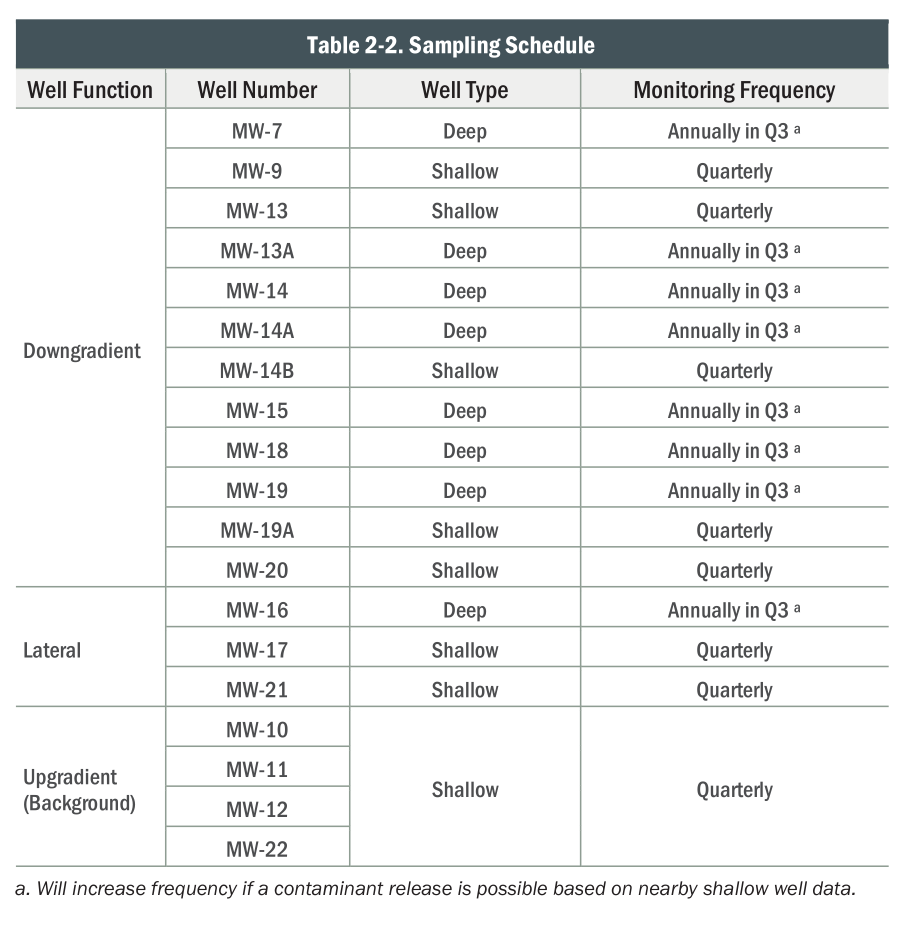
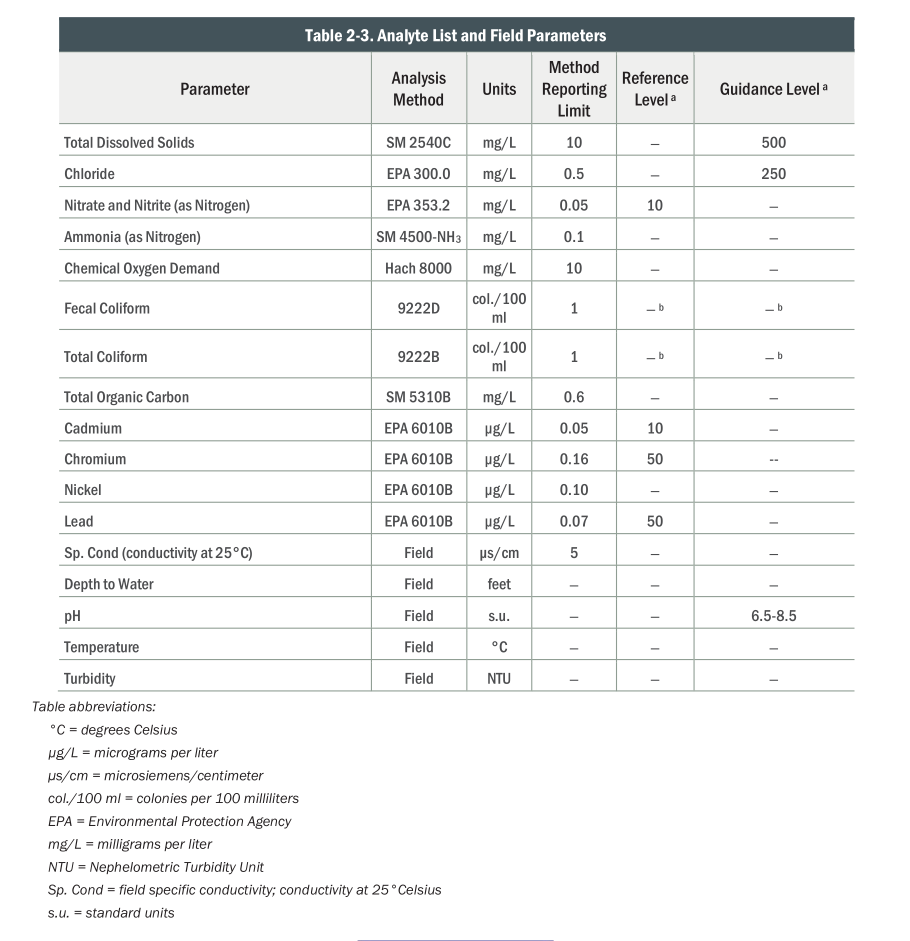

# Wastewater in Eugene

Our wastewater
(sewer plus stormwater)
in Eugene and Springfield
is treated by the
[Metropolitan Wastewater Management Commission](https://mwmcpartners.org/),
in part at the [Biosolids Management Facility](https://mwmcpartners.org/facilities/biosolids-management-facility/)
(see slideshow on that page).

. . .

As part of their operating requirements,
they monitor groundwater for potential contamination:
in 26 monitoring wells, since 1988.

. . .

Their biggest question: *how to best detect if the facility is affecting the groundwater?*

. . .

**Note:** the MWMC is very much on top of this, and has no evidence of groundwater contamination.
This is being presented for pedagogical purposes.

## What is measured?

::: {.columns}
:::::: {.column width=50%}



::::::
:::::: {.column width=50%}

)

::::::
:::

## Overview of the data:

We've got:

- Information about the wells: [BMF_Well_details_2023_GWMP.csv](/data/BMF_Well_details_2023_GWMP.csv)

- The actual measurements: [Eugene_BiosolidsManagementFacility_GroundwaterData.csv](/data/Eugene_BiosolidsManagementFacility_GroundwaterData.csv)

## Set-up

```{python setup}
import pandas as pd
import numpy as np
import plotnine as p9
import folium, pyproj
```

# "Look at the data", part 1

Game plan:

- How many wells are there?
- How many observations do we have from each, of what quantities, and over what time periods?
- Where are the wells, and what do we know about them?

. . .

*Preliminary answers above; but let's check this!*


## Measurements

- Measurements often run into detection limits; this is conveyed as "censoring status".
- `well.name` is the name of the location with the first year it was in operation appended

```sh
$ head data/Eugene_BiosolidsManagementFacility_GroundwaterData.csv | tr ',' '\t'
"well.name"	"SampledDate"	"SampleNumber"	"ParameterName"	"ParameterUnits"	"result"	"Method.Detection.Limit"	"Reporting.limit"	"censoring.status"	"Easting"	"Northing"
"MW-13-1988"	1988-01-25	"880050"	"Ammonia"	"mg/L"	0.1	NA	NA	"left.censored"	4218262.9	910814.599999998
"MW-13A-1988"	1988-01-25	"880052"	"Ammonia"	"mg/L"	0.1	NA	NA	"left.censored"	4218304.4	910813.2
"MW-14-1988"	1988-01-25	"880054"	"Ammonia"	"mg/L"	0.1	NA	NA	"left.censored"	4217612.3	910814.700000002
"MW-14A-1988"	1988-01-25	"880055"	"Ammonia"	"mg/L"	0.1	NA	NA	"left.censored"	4217622.5	910814.499999998
"MW-14B-1988"	1988-01-25	"880058"	"Ammonia"	"mg/L"	0.1	NA	NA	"left.censored"	4217612.9	910804.299999995
"MW-13-1988"	1988-01-25	"880050"	"Cadmium"	"µg/L"	1	NA	NA	"left.censored"	4218262.9	910814.599999998
"MW-13A-1988"	1988-01-25	"880052"	"Cadmium"	"µg/L"	1	NA	NA	"left.censored"	4218304.4	910813.2
"MW-14-1988"	1988-01-25	"880054"	"Cadmium"	"µg/L"	1	NA	NA	"left.censored"	4217612.3	910814.700000002
"MW-14A-1988"	1988-01-25	"880055"	"Cadmium"	"µg/L"	1	NA	NA	"left.censored"	4217622.5	910814.499999998
```

## Pull in the data

```{python thedata}
gw = (
    pd.read_csv("data/Eugene_BiosolidsManagementFacility_GroundwaterData.csv")
    .convert_dtypes()
    .rename(columns=lambda x: x.replace(".", "_"))
    .assign(SampledDate = lambda df: pd.to_datetime(df['SampledDate']))
)
gw
```

## What's measured?

```{python meas}
gw.groupby("ParameterName")['result'].describe()
```

## How many things are measured?

Tabular form:
```{python tab}
pd.crosstab(gw['well_name'], gw['ParameterName'])
```

## When was each well used?

```{python nyear}
(
    pd.crosstab(gw['well_name'], gw['SampledDate'].dt.year)
    .reset_index()
    .melt(id_vars=['well_name'])
    .assign(year=lambda df: pd.to_numeric(df['SampledDate']))
    >>
    p9.ggplot(p9.aes(x='year', y='value', color='well_name'))
    + p9.geom_point() + p9.geom_line()
) + p9.theme(figure_size=(16,6))
```

## When was each thing measured?

```{python myear}
(
    pd.crosstab(gw['ParameterName'], gw['SampledDate'].dt.year)
    .reset_index()
    .melt(id_vars=['ParameterName'])
    .assign(year=lambda df: pd.to_numeric(df['SampledDate']))
    >>
    p9.ggplot(p9.aes(x='year', y='value', color='ParameterName'))
    + p9.geom_point() + p9.geom_line()
    + p9.labs(y='number of measurements')
    + p9.theme(figure_size=(16,6))
)
```

## Summary:

> How many observations do we have from each, of what quantities, and over what time periods?

*Exercise.*

# Where are the wells?


## Well info


```sh
$ cat data/BMF_Well_details_2023_GWMP.csv | tr ',' '\t'
LocationName	well.orientation	well.depth.category	screened.interval.feet
MW-7	downgradient	deep	42 to 52
MW-9	downgradient	shallow	15 to 25
MW-13A	downgradient	deep	30 to 50
MW-14	downgradient	deep	55 to 75
MW-14A	downgradient	deep	30 to 50
MW-14B	downgradient	shallow	10 to 25
MW-15	downgradient	deep	30 to 50
MW-18	downgradient	deep	30 to 50
MW-19	downgradient	deep	30 to 50
MW-19A	downgradient	shallow	10 to 25
MW-20	downgradient	shallow	10 to 25
MW-16	lateral	deep	30 to 50
MW-17	lateral	shallow	10 to 25
MW-21	lateral	shallow	10 to 25
MW-10	upgradient	shallow	15 to 25
MW-11	upgradient	shallow	15 to 25
MW-12	upgradient	shallow	15 to 25
MW-22	upgradient	shallow	10 to 25
MW-13-2024	downgradient	shallow	10 to 25
```

## Get per-well summaries from this

We'd like the *location* to be in the per-well table,
so let's pull this out of the "measurements" file first:

```{python gwwells}
gw_wells = (
    gw.groupby(['well_name', 'Easting', 'Northing'])
    .aggregate(
        n = ('SampleNumber', lambda x: len(x)),
    )
    .reset_index()
    .assign(
        LocationName = lambda df: "MW-" + df['well_name'].str.extract("-([0-9A-Z]*)-"),
        FirstYear = lambda df: df['well_name'].str.extract("-([0-9A-Z]*)$")
    )
)    
gw_wells.loc[gw_wells['well_name'] == "MW-13-2024", 'LocationName'] = "MW-13-2024"
```

## Well information

```{python thewells}
wells = pd.merge(
    (
        pd.read_csv("data/BMF_Well_details_2023_GWMP.csv")
        .convert_dtypes()
        .rename(columns=lambda x: x.replace(".", "_"))
    ),
    gw_wells, how='outer', on='LocationName'
)
wells
```

## Mapping

Let's use [folium](https://python-visualization.github.io/folium/latest/index.html).
Looking at [the documentation](https://python-visualization.github.io/folium/latest/reference.html#module-folium.folium),
we need a location in "*Latitude and Longitude of Map (Northing, Easting)*".

> Easting and Northing coordinates are provided in the [ESPG: 2270](https://spatialreference.org/ref/epsg/2270/) Coordinate Reference System (NAD83 / Oregon South (ft))

So first: find the center of the well locations,
and project it to lat/long.

```{python center}
def transform(easting, northing):
    crs = pyproj.CRS.from_epsg(2270)
    latlon = pyproj.CRS(proj='latlon', datum='WGS84')
    transformer = pyproj.Transformer.from_crs(crs, latlon)
    y, x = transformer.transform(easting, northing)
    return (x, y)

center = transform(wells['Easting'].mean(), wells['Northing'].mean())
center
```

## The wells:

```{python firstmap}
folium.Map(location=center, zoom_start=16)
```

## Let's get some more info on that:

After some iteration:

```{python folium_stuff}
def add_marker(m, row=None, tooltip=None, location=None, **kwargs):
    defaults = {
        'radius': 10,
        'fill_color': "orange",
        'fill_opacity': 0.4,
        'color': 'black',
        'weight': 1
    }
    defaults.update(kwargs)
    if location is None:
        location = transform(row.Easting, row.Northing)
    if tooltip is None and row is not None:
        tooltip = row.LocationName
    return folium.CircleMarker(
        location=location,
        tooltip=tooltip,
        **defaults
    ).add_to(m)

well_bbox = (
    transform(wells['Easting'].min(), wells['Northing'].min()),
    transform(wells['Easting'].min(), wells['Northing'].max()),
    transform(wells['Easting'].max(), wells['Northing'].max()),
    transform(wells['Easting'].max(), wells['Northing'].min()),
)
def add_legend(m, colors, k=8):
    dy = (well_bbox[1][0] - well_bbox[0][0])/k
    pos = list(well_bbox[2])
    for n in colors:
        add_marker(m, location=pos, fill_color=colors[n]).add_to(m)
        label = n if type(n) is str else 'NA'
        folium.Marker(
            pos,
            icon=folium.DivIcon(
                icon_size=(100,30),
                icon_anchor=(-15,15),
                html=f'<div style="font-size: 15pt">{label}</div>',
            )
        ).add_to(m)
        pos[0] -= dy
```

## Well orientation:

```{python well_orientation}
orientation_colors = {
    'upgradient' : "#7fc97f",
    'downgradient' : "#beaed4",
    'lateral' : "#fdc086",
    pd.NA : "#666666",
}

m = folium.Map(location=center, zoom_start=16)
add_legend(m, orientation_colors)
for r in wells.itertuples():
    add_marker(m, r,
        fill_color=orientation_colors[r.well_orientation],
    )

m
```

## Well depth:

```{python well_depth}
depth_colors = {
    'shallow' : "#7fc97f",
    'deep' : "#fdc086",
    pd.NA : "#666666",
}

m = folium.Map(location=center, zoom_start=16)
add_legend(m, depth_colors)
for r in wells.itertuples():
    add_marker( m, r,
        fill_color=depth_colors[r.well_depth_category],
    )

m
```

## Summary

> Where are the wells, and what do we know about them?

*Exercise*


# "Look at the data", part 2

Game plan:

- Do the measurements differ most:

  * between wells?
  * between types of well? (up/downgradient, shallow/deep)
  * between years?
  * between seasons?
  * all/some of the above?

- Do nearby wells get similar measurements?


## All the data, from 20,000 feet

```{python all_the_data}
(
    p9.ggplot(gw, p9.aes(x="SampledDate", y="result", color='well_name'))
    + p9.geom_line() + p9.geom_point(size=0.2, alpha=0.25)
    + p9.facet_grid(rows="ParameterName", scales='free_y')
) + p9.theme(figure_size=(8,24))
```

## Observations?

What features do we see here
and what do those features suggest doing?

*Exercise*

## Set-up:

Let's add well categories to the measurement data:

```{python more_info}
gw = pd.merge(
    gw,
    wells.loc[:,('well_name', 'well_orientation', 'well_depth_category')],
    how='left',
    on='well_name'
)
gw.head()
```

## Periodicity in water table elevation

*Observations?*

```{python wte}
(
    gw
    .query("ParameterName == 'WaterTableElevation'")
    >>
    p9.ggplot(p9.aes(x="SampledDate.dt.dayofyear", y="result", color='factor(SampledDate.dt.year)'))
    + p9.geom_point(size=0.5, alpha=0.75) + p9.geom_line()
    + p9.facet_wrap("well_name")
) + p9.theme(figure_size=(8,16))
```

## Nitrate

*Observations?*

```{python nitrate}
(
    gw
    .query("ParameterName == 'Nitrate'")
    >>
    p9.ggplot(p9.aes(x="SampledDate", y="result", color='well_depth_category'))
    + p9.geom_point(size=0.5, alpha=0.5) + p9.geom_line()
    + p9.facet_grid(rows="well_name")
) + p9.theme(figure_size=(8,24))
```

## Chromium

```{python chromium}
(
    gw
    .query("ParameterName == 'Chromium'")
    >> p9.ggplot(p9.aes(x="SampledDate", y="result", color="well_depth_category", group="well_name"))
    + p9.geom_line() + p9.geom_point(size=0.5, alpha=0.5)
) + p9.theme(figure_size=(12,6))
```

## Chromium, better

```{python chromium}
(
    gw
    .query("ParameterName == 'Chromium'")
    >> p9.ggplot(p9.aes(x="SampledDate", y="result", color="well_depth_category", group="well_name"))
    + p9.geom_line() + p9.geom_point(size=0.5, alpha=0.5)
    + p9.scale_y_log10()
) + p9.theme(figure_size=(12,6))
```

## Conductivity

```{python conduct}
(
    gw.query("ParameterName == 'Conductivity'")
    >>
    p9.ggplot(p9.aes(x="SampledDate", y="result", color='well_depth_category', group='well_name'))
    + p9.geom_point(size=0.5, alpha=0.5) + p9.geom_line()
) + p9.theme(figure_size=(12,6))
```

## Without seasonal variation?

```{python conductm}
conductivity = (
    gw
    .query("ParameterName == 'Conductivity'")
    .assign(year = lambda df: df['SampledDate'].dt.year)
    .assign(mean_conductivity = lambda df: df.groupby(['well_name', 'year'])['result'].transform("mean"))
    .assign(diff_conductivity = lambda df: df['result'] - df['mean_conductivity'])
)
```

```{python conduct2}
(
    conductivity
    >>
    p9.ggplot(p9.aes(x="SampledDate", y="mean_conductivity", color='well_depth_category', group='well_name'))
    + p9.geom_point(size=0.2, alpha=0.25) + p9.geom_line()
    + p9.theme(figure_size=(12,6))
) / (
    conductivity
    >>
    p9.ggplot(p9.aes(x="SampledDate", y="diff_conductivity", color='well_depth_category', group='well_name'))
    + p9.geom_point(size=0.2, alpha=0.25) + p9.geom_line()
    + p9.theme(figure_size=(12,12))
)
```

## For which reasons to measurements differ?

Which measurements differ most:

  * between wells?
  * between types of well? (up/downgradient, shallow/deep)
  * between years?
  * between seasons?
  * all/some of the above?


## Update: observations?

What features do we see here
and what do those features suggest doing?

*Exercise, con'td*


# "Look at the data", part 3

*Next steps:* brainstorm!

Ideas? Questions?

> Do nearby wells get similar measurements?
