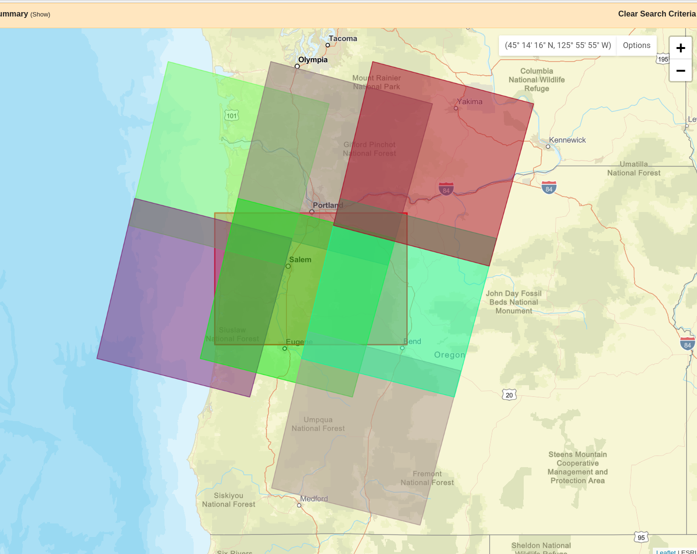
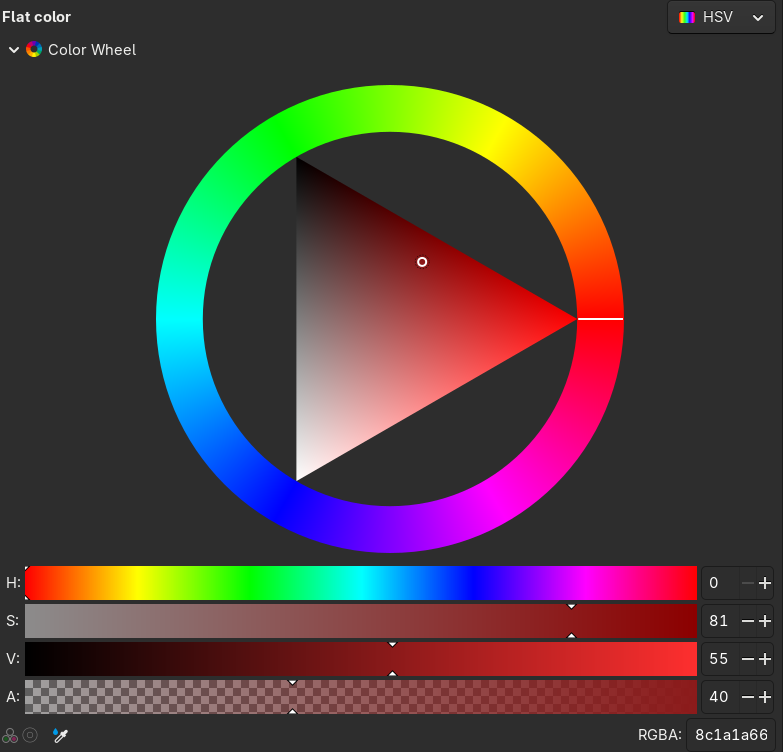

# Data: Landsat images

## 

::: columns
:::::: {.column width=50%}

> The [NASA/USGS Landsat program](https://science.nasa.gov/mission/landsat/)
> provides the longest continuous space-based record of Earth’s land in
> existence. Landsat data are essential for making informed decisions about our
> planet’s resources and environment.

::::::
:::::: {.column width=50%}


::::::
:::


##


::: columns
:::::: {.column width=50%}

Data (Landsat 8/9): 

- 700 scenes/day, 185km wide
- 11 spectral bands from a [multispectral scanner](https://en.wikipedia.org/wiki/Multispectral_Scanner)
- 15m/30m/100m pixels

](resources/landsat_bands.png)

::::::
:::::: {.column width=50%}


:::: caption
[Virginia Norwood](https://en.wikipedia.org/wiki/Virginia_T._Norwood)
::::

::::::
:::


## Obtaining the data


::: columns
:::::: {.column width=50%}

It's free: from [earthexplorer.usgs.gov](https://earthexplorer.usgs.gov/)

as [GeoTIFF](https://blogs.loc.gov/maps/2023/05/the-secret-life-of-geotiffs/) raster files

and there's a LOT of it: each scene is ~1G

```sh
$ ls -lath *.tar
-rw-rw-r-- 1 peter peter 948M Mar  1 08:33 LC08_L2SP_046029_20250602_20250607_02_T1.tar
-rw-rw-r-- 1 peter peter 962M Mar  1 08:29 LC08_L2SP_046029_20200604_20200825_02_T1.tar

```

::::::
:::::: {.column width=50%}



::::::
:::

# Raster data in python

Some good references:

- the [rasterio docs](https://rasterio.readthedocs.io/en/stable/quickstart.html)
- [geocomputation with python](https://py.geocompx.org/02-attribute-operations#sec-manipulating-raster-objects)

```{python setup}
import pandas as pd
import geopandas as gpd
import numpy as np
import pyproj
import contextily
import json
import matplotlib.pyplot as plt
import shapely
import rasterio
import rasterio.plot
import rasterio.mask
```

## Files

I've picked a day without a lot of clouds (Aug 25, 2020),
downloaded the data above Eugene,
unpackaged the tar archive and put the basic bands,
cropped somewhat for file size,
in [data/landsat](/data/landsat):

- [Metadata file for bands](/data/landsat/LC08_L2SP_046029_20200604_20200825_02_T1_MTL.json)
- [Band 1](/data/landsat/LC08_L2SP_046029_20200604_20200825_02_T1_SR_B1.TIF)
- [Band 2](/data/landsat/LC08_L2SP_046029_20200604_20200825_02_T1_SR_B2.TIF)
- [Band 3](/data/landsat/LC08_L2SP_046029_20200604_20200825_02_T1_SR_B3.TIF)
- [Band 4](/data/landsat/LC08_L2SP_046029_20200604_20200825_02_T1_SR_B4.TIF)
- [Band 5](/data/landsat/LC08_L2SP_046029_20200604_20200825_02_T1_SR_B5.TIF)
- [Band 6](/data/landsat/LC08_L2SP_046029_20200604_20200825_02_T1_SR_B6.TIF)
- [Band 7](/data/landsat/LC08_L2SP_046029_20200604_20200825_02_T1_SR_B7.TIF)
- [thumbnail, large](/data/landsat/LC08_L2SP_046029_20200604_20200825_02_T1_thumb_large.jpeg)
- [thumbnail, small](/data/landsat/LC08_L2SP_046029_20200604_20200825_02_T1_thumb_small.jpeg)


## Metadata

You'll need to get the data, linked on the previous slide or from [github](https://github.com/UOdsci/ds435/tree/main/data/landsat),
and put it in the `data/landsat/` subdirectory.

This comes with a JSON metadata file:
```{python json}
ddir = "data/landsat"
fname = "LC08_L2SP_046029_20200604_20200825_02_T1"
with open(f"{ddir}/{fname}_MTL.json", "r") as f:
    md = json.loads(f.read())

list(md['LANDSAT_METADATA_FILE'].keys())
```

## Of note: file names

```{python fns}
md['LANDSAT_METADATA_FILE']['PRODUCT_CONTENTS']
```

## Opening a raster:

```{python rrio}
band5 = rasterio.open(ddir + "/" + md['LANDSAT_METADATA_FILE']['PRODUCT_CONTENTS']['FILE_NAME_BAND_5'])
band5.shape
```

```{python band5}
band5.meta
```

## Viewing the raster:

```{python plotband5}
fig, ax = plt.subplots()
rasterio.plot.show(band5, ax=ax)
ax.set_title("Band 5");
```

## Viewing the raster, in context:

Note the `crs`!

```{python plotband5}
bbox = gpd.GeoSeries(shapely.geometry.box(*band5.bounds), crs=band5.crs)

fig, ax = plt.subplots(figsize=(10,10))
bbox.plot(ax=ax, alpha=0)
contextily.add_basemap(ax, crs=band5.crs)
rasterio.plot.show(band5, ax=ax, alpha=0.5)
ax.set_title("Band 5");
```

## Values:

`raster.read()` gets a numpy array of the values.
Note the *missing data*:

```{python hist}
plt.hist(
    band5.read().flatten(),
    bins=100,
);
```

# Now, let's explore!

*Things we won't talk about:* (see [the docs](resources/LSDS-1619_Landsat8-9-Collection2-Level2-Science-Product-Guide-v6.pdf) for a lot more!)

- USGS provides lots of downstream data products! Sophisticated combinations of bands to help:

  * ignore clouds
  * get useful real-world measurements (snow cover, thermal upwelling...)

- What the spectral bands "mean"

- How these bands relate to what we see 

- What people usually use this data for

## Goals:

Basically, "make a nice picture".

. . .

Concretely:
make a map where color communicates something important about land type.

. . .

Two possible workflows:

1. Pick a few 'different' locations on the map;
   find some combinations of bands that distinguish those;
   map these to colors.

2. Do PCA, and map the PCs to colors.


## A quick reminder about "colorspace":


::: columns
:::::: {.column width=50%}

- Human retinas most commonly have three kinds of color-sensitive photoreceptors.
- So, our color perception is "three-dimensional".
- Printing: RGB (e.g., #<span style='color: red;'>3A</span><span style='color: green;'>11</span><span style='color: blue;'>FF</span>;) or CMYK
- Perception: [HSL and HSV](https://en.wikipedia.org/wiki/HSL_and_HSV)
- **Plus:** transparancy, or `alpha`: #<span style='color: #FF0000FF;'>3A</span><span style='color: #00FF00FF;'>11</span><span style='color: #0000FFFF;'>FF</span><span style='color: #00000088;'>00</span>;
- On computer monitors, RGB values range from 0 to 255.

So, by "make an image" we mean "make 1 to 3 rectangular arrays of integers between 0 and 255".

::::::
:::::: {.column width=50%}



::::::
:::

## Brainstorming:

1. Pick a few 'different' locations on the map;
   find some combinations of bands that distinguish those;
   map these to colors.

2. Do PCA, and map the PCs to colors.

. . .

- What is the difference between these?
- How would we actually do (1)?
- How would we actually do (2)?


# Tools

We could just reduce the landsat images to arrays,
but we'd like to maintain spatial context.

So, we'll need to:

- Extract values from all the bands at particular locations.
- Extract values from all the bands averaged across polygons (e.g., a circle around a location).
- Combine together bands arithmetically.
- Turn the result into an image.

## Get the bands in order:

*Note:* beware; trying to do some things with all of these
(e.g., plot them all) might crash your browser.

```{python bands}
band_names = [f"BAND_{k}" for k in range(1,7)]
file_names = {
    bn : ddir + "/" + md['LANDSAT_METADATA_FILE']['PRODUCT_CONTENTS']["FILE_NAME_" + bn]
    for bn in band_names
}
bands = { bn: rasterio.open(file_names[bn]) for bn in band_names }
```

# Working with layers

First let's look at mapping values to images, and rescaling.

## Low contrast?

```{python plotband5a}
fig, ax = plt.subplots()
rasterio.plot.show(band5, ax=ax)
ax.set_title("Band 5");
```

## Well, that makes sense:

```{python plotband5b}
values = band5.read(masked=True).squeeze()
print('data:', values.data.shape, 'mask:', values.mask.shape)
plt.hist(values.data[~values.mask], bins=100);
```

## Let's rescale!

And, let's work with just numpy arrays for a bit.
```{python arrays}
plt.imshow(values)
```

## Rescaling:

And, let's work with just numpy arrays for a bit.
```{python rescale}
a, b = np.quantile(values.data[~values.mask], q=[0.05, 0.95])
values = (values - a) / (b - a)
values = np.minimum(1.0, np.maximum(0.0, values))
values = (255 * values).astype(int)
plt.imshow(values)
```

## How about in color?

```{python manybands}
def norm_values(bn):
    values = bands[bn].read(masked=True)
    a, b = np.quantile(values.data[~values.mask], q=[0.05, 0.95])
    values = 255*(values - a)/(b - a)
    values[values<0] = 0
    values[values>255] = 255
    return values.astype(int)
    
values = np.ma.array([norm_values(bn) for bn in ["BAND_5", "BAND_6", "BAND_6"]]).squeeze()
values = np.moveaxis(values, [0, 1, 2], [2, 0, 1])
print('values:', values.shape)
plt.imshow(values);
```

## Putting this back on a map:

All it takes is the right `transform` argument!
```{python mapit0}
fig, ax = plt.subplots(figsize=(10,10))
bbox.plot(ax=ax, alpha=0)
contextily.add_basemap(ax, crs=bands["BAND_5"].crs)
rasterio.plot.show(np.moveaxis(values, [0,1,2], [1,2,0]), transform=bands["BAND_5"].transform, ax=ax, alpha=0.5);
```

## Or, with `ax.imshow`:

```{python mappit}
fig, ax = plt.subplots(figsize=(10,10))
bbox.plot(ax=ax, alpha=0)
contextily.add_basemap(ax, crs=bands["BAND_5"].crs)
ax.imshow(values, extent=bbox.bounds[['minx', 'maxx', 'miny', 'maxy']].values[0], alpha=0.5);
ax.set_title("Band 5");
```


# Extracting values

We'll do this "by hand"; another method would use [rasterstats](https://pythonhosted.org/rasterstats/).

First: pick some points:
```{python points}
npts = 10
pts = bbox.sample_points(npts, seed=123)
pd.concat([pts, bbox]).explore()
```

## Pour one out for the NAs

Some of the points will be outside the area of the raster:

```{python nas}
bn = 'BAND_5'
xyz = pts.get_coordinates()
xyz[bn] = np.array(list(bands[bn].sample([xy[1:] for xy in xyz.itertuples()]))).flatten()
xyz
```

## Rejection sampling:

Let's sample more than we need and restrict to ones coved by the data:


```{python subset}
pts = bbox.sample_points(2*npts, seed=123).explode(index_parts=True)[0]
xyz = pts.get_coordinates()
xyz[bn] = np.array(list(bands[bn].sample([xy[1:] for xy in xyz.itertuples()]))).flatten()
pts = pts.loc[xyz[bn] > 0][:npts]
pd.concat([pts, bbox]).explore()
```

## Extracting values from circles

A single pixel seems kinda... noisy?
Let's take averages within some buffer around each point.

```{python circles}
pts = pts.buffer(5000)
pd.concat([pts, bbox]).explore()
```

## 

Of use: `mask`

```{python acircle}
im, mask = rasterio.mask.mask(
    bands['BAND_5'], 
    [pts.iloc[0]],
    crop=True,
    filled=False,
)
print("shape: {im.shape}")
plt.imshow(im.squeeze());
```

## Let's get some tooling together:

1. Write a fuction that gets average values in each of a bunch of polygons
   from a band.
2. Apply that function to each of our bands.

```{python fn}
def zonal_means(pts, band):
    pass

point_data = gpd.GeoDataFrame(pts)
```
