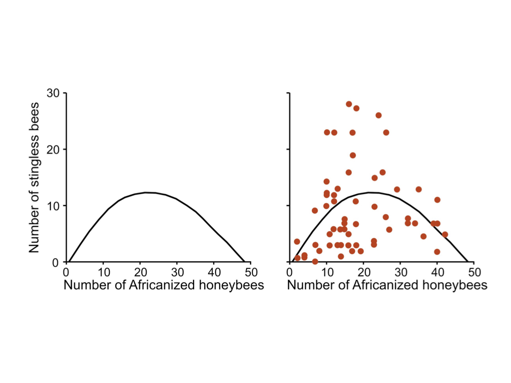
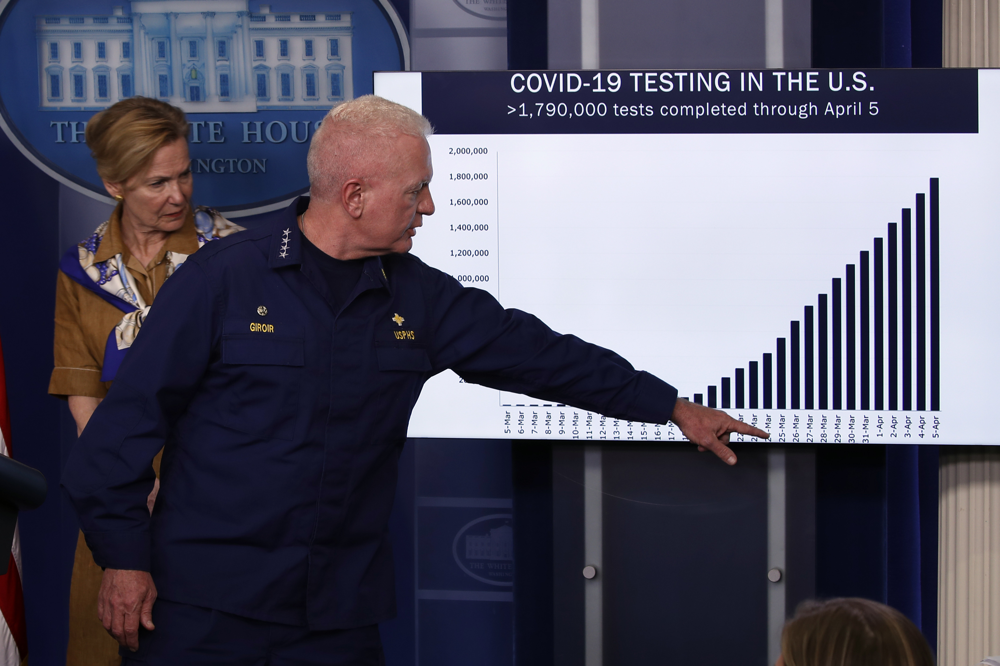
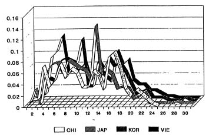
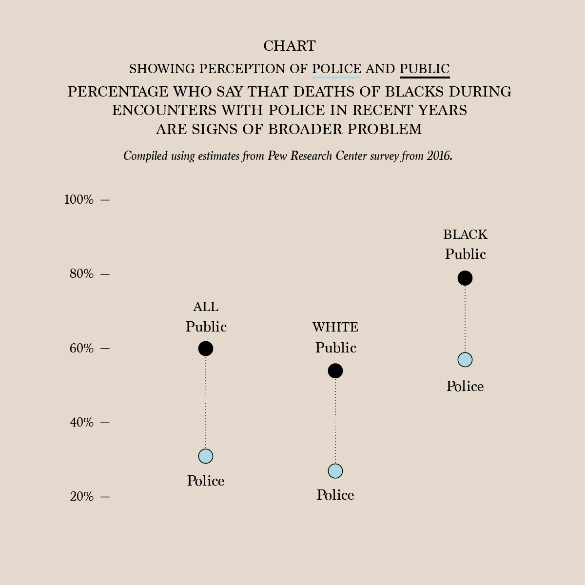
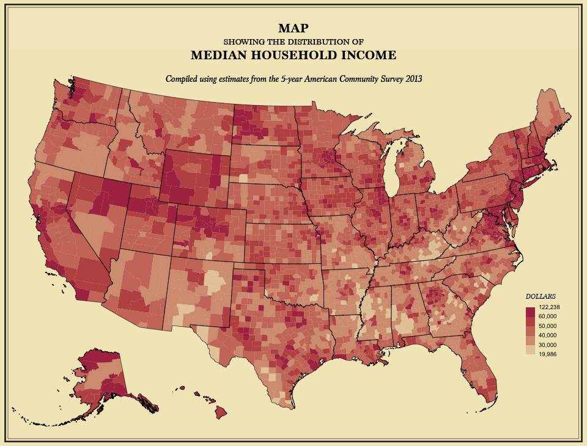
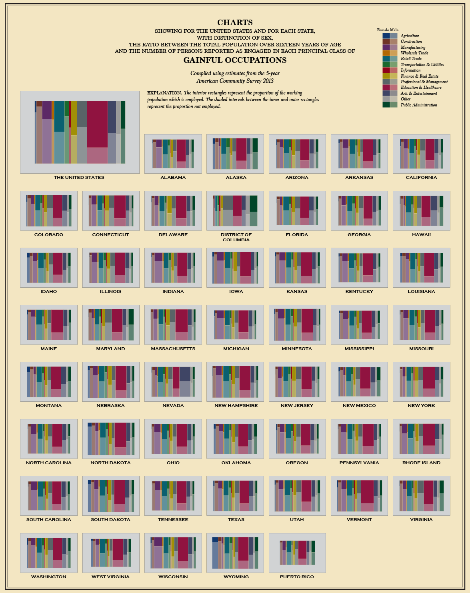
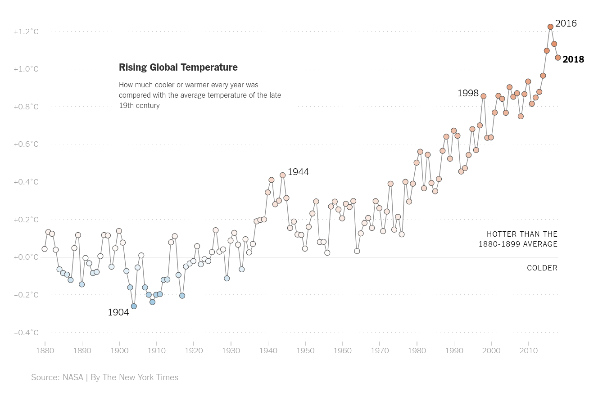
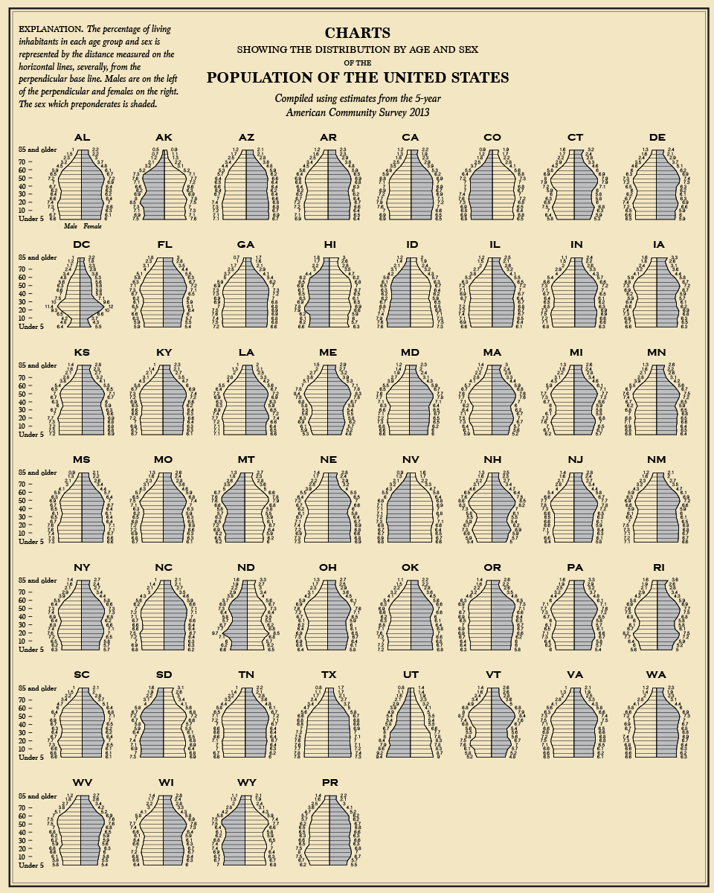
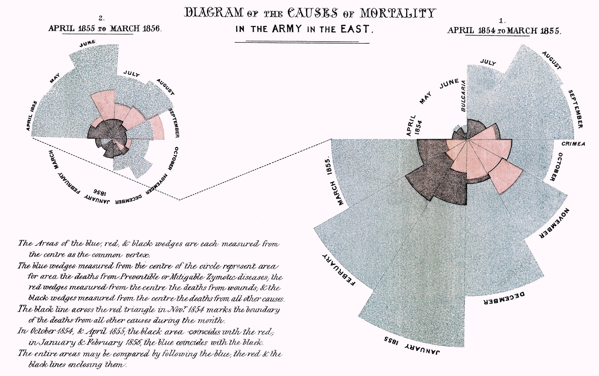

---
title: "Graphics and visualization"
date: 2026-01-12
author: Peter Ralph
execute: 
  enabled: true
format:
    revealjs: default
    html: default
---

# Visualization

## Goals

- pattern discovery

- efficient summary of information

- visual/spatial analogy for quantitative patterns


. . .

Aim to **maximize information and minimize ink**.

*paraphrased from Edward Tufte*


## Considerations

::: {.columns}
:::::: {.column width=50%}

- Is the visual analogy appropriate for the *type* of data? 

*counts? quantities? multivariate? relationships?*

- Are important *comparisons* clear?

*between groups? differences? time trend?*

- Are *units* easily interpretable?

*meters? dollars? percent? relative change? is it isometric?*

:::
:::::: {.column width=10%}

:::
:::::: {.column width=40%}

```{python plots}
#| echo: false
import numpy as np
import pandas as pd
import plotnine as p9
rng = np.random.default_rng(seed=123)
n = 50
k = 4
labels = ['A', 'B', 'C', 'D'][:k]
m = 1 + rng.poisson(lam=10, size=k)
x = pd.DataFrame({
    'a' : rng.choice(labels, size=n),
})
x['z'] = rng.poisson(lam=m[np.searchsorted(labels, x['a'])], size=n)

p0 = p9.ggplot(x, p9.aes(x='a', y='z')) + p9.labs(x='', y='value')
p1 = p0 + p9.geom_col()
p2 = p0 + p9.geom_boxplot()
p3 = p0 + p9.geom_point(position=p9.position_jitter(width=0.1, height=0))
(p1 / p2 / p3) + p9.theme(figure_size=(3,6))
```

:::
:::::: 

## Principles of effective display

- Show the data

- Encourage the eye to compare differences
  
- Represent magnitudes honestly and accurately

- Draw graphical elements clearly, minimizing clutter

- Make displays easy to interpret

## 

> Above all else show the data.

*Tufte 1983*

{width=60%}\

## Think about what you want to communicate

::: {.centered}
{width=80%}\
:::
::: {.aside}
[AP Images: Alex Brandon](http://www.apimages.com/metadata/Index/Virus-Outbreak-Trump/f2c5f8d116a24062b563a32cea88235e/1/0)
:::

##

::: {.centered}
{width=80%}\
:::
::: {.aside}
from *Roeder K (1994), Statistical Science 9:222-278, Figure 4* via [Karl Broman](https://www.biostat.wisc.edu/~kbroman/topten_worstgraphs/)
:::


# Deconstructing the graphics

## How is information conveyed in this chart?

::: {.columns}
:::::: {.column width=50%}

\

::: aside
From a 2016 survey by the Pew Research Center,
via [flowingdata](https://flowingdata.com/2020/06/08/police-perception-vs-public-perception/).
:::

::::::
:::::: {.column width=50%}


::::: incremental

- percentage values are mapped to vertical coordinate
- columns are groups of people
- color of points shows "public" versus "police"
- lines connect 'public' and 'police' pair in a given group
- length of lines connecting points shows difference between public and police percentages
- labeled ticks on y-axis shows what the values are
- y-axis scale is chosen so vertical distance is proportional to percentage difference

:::::

::::::
:::

**Question:** Pros/cons of this plot versus table with 6 numbers?

## How about this chart?

{width=75%}\

*From the 5-year American Community Survey 2013,
via [flowingdata](https://flowingdata.com/2015/06/16/reviving-the-statistical-atlas-of-the-united-states-with-new-data/#jp-carousel-41608)*


##

::: {.columns}
:::::: {.column width=40%}

Mosaicplots of 
gainful occupations,

from
[flowingdata](https://flowingdata.com/2015/06/16/reviving-the-statistical-atlas-of-the-united-states-with-new-data/#jp-carousel-41583)
again

::::::
:::::: {.column width=10%}

::::::
:::::: {.column width=50%}

\

::::::
:::

##

\

from
[NYT](https://www.nytimes.com/2019/10/03/learning/whats-going-on-in-this-graph-oct-9-2019.html)

##

\

From: [flowingdata](https://flowingdata.com/2015/06/16/reviving-the-statistical-atlas-of-the-united-states-with-new-data/#jp-carousel-41583)

##

{width=80%}\


# Output formats

## Options:

- bitmap (e.g., png)
- vector (e.g., svg, pdf)
- html (includes the others)
- interactive? (e.g., [bokeh](https://bokeh.org), [plotly](https://plotly.com), [shiny](https://shiny.posit.co/), [d3](https://d3js.org))
- dashboard?


## How does interactivity work?

tdlr; usually in the web browser, with javascript

For example:

- [bokeh's IMDB browser](https://demo.bokeh.org/movies): an HTML5 [Canvas](https://en.wikipedia.org/wiki/Canvas_element)
- [plotly's snowpack dashboard](https://snowpack-telemetry.plotly.app/): an [SVG](https://en.wikipedia.org/wiki/SVG)


## Considerations

- How much time do you want to spend making the plot?
- Who will see the plot, and what is their background?
- How much time will they spend looking at the plot?
- How will the plot be distributed?
- What do you want the plot to communicate?

. . .

*For instance:*

- Quick viz plot for me: what's this look like?
- In-depth viz plots for mostly me: show me the data.
- Punchy plot for a report: here is the main point.
- Beautiful multi-layered plot for data nerds: the data are telling their own story.
- Dashboard: I am the commander of the Starship Enterprise.


## In this class

Generally, exploratory data analysis is *quick*:
we try out many things, and narrow in on useful visualizations.

So: simple, easy plots.
We'll be using [plotnine](https://plotnine.org),
an implementation of the [Grammar of Graphics](https://vita.had.co.nz/papers/layered-grammar.html),
that encourages us to abstract the idea of visuallly representing data
and makes it easy to incrementally develop plots.


