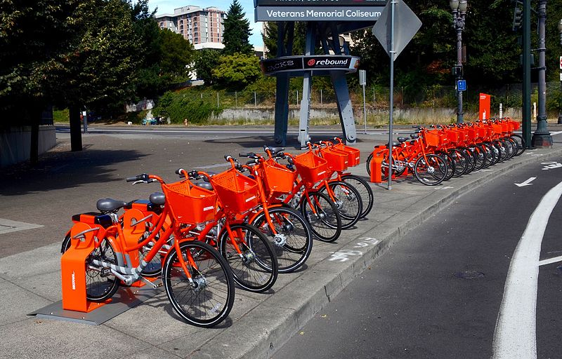

# Spatial point data: Biketown

{width=70%}

##



##


## 

```{python setup}
import pyproj
import geopandas as gpd
import pandas as pd
import numpy as np
import scipy.ndimage
import matplotlib.pyplot as plt
import contextily
```

## August, 2018

Here is data from [August, 2018](data/biketown/2018_08.csv.gz).

```{python aug}
df = pd.read_csv("data/biketown/2018_08.csv.gz")
df = df.loc[~df['StartLatitude'].isna(),:]
df.head(n=5)
```

## Transform points

First, we'd like actual spatial points
in a sensible (isometric) coordinate system:
```{python crs}
df['start_points'] = gpd.points_from_xy(df.StartLongitude, df.StartLatitude, crs="EPSG:4326").to_crs("EPSG:5070")
df['end_points'] = gpd.points_from_xy(df.EndLongitude, df.EndLatitude, crs="EPSG:4326").to_crs("EPSG:5070")
gdf = gpd.GeoDataFrame(df, geometry=df['start_points'], crs=5070)
gdf[:1000].explore()
```

## Goals

1. Where do most trips start?
2. Where do they end up?
3. Is there a net flux of bikes anywhere?

We'll make some maps with *spatial smoothing* to answer this,
and evaluate if that was a good tool for the job.

# Interlude: when there's lots of data

## Too much data?

In this class we've mostly not worried about computation.
Modern computers deal with vectors of length $10^7$--$10^8$
pretty much instantly.

. . .

But, what if you've got more?
**Options:**

1. Use less data.
2. Look at summaries of the data.

. . .

Considerations:

- Do you really need $n=10^{12}$ for whatever you're looking for? Probably not!
- If you sub-sample, make sure the sub-sampling is appropriate
    (i.e., if the sub-sample has structure, it's structure you want to look at).
- You probably want to pilot your summaries on a sub-sample anyhow.

## Too much data, take two

It's real easy to run into "too much data" in *spatial* contexts,
basically because $N^2 > N$.

. . .

Why?

- *Images/rasters:* my display is 2256 x 1504, which is 3.3M pixels.
  It's easy to have a lot of images.

- *Pairwise comparisons:* Many spatial operations require operating
  "nearby" objects.
  Naively, that requires working with all $O(N^2)$ pairwise distances.


## Example: kernel density estimation


Suppose we have a bunch of points

$$ (x_1, y_1), \ldots, (x_n, y_n) $$

with density $f(x,y)$, i.e.,

$$
f(x,y) \approx \frac{\#(\text{of points within $r$ of $(x,y)$})}{\pi r^2}
$$

##

Using (for instance)

$$
\rho_\sigma(x,y) = \frac{1}{2\pi\sigma^2} e^{-\frac{x^2+y^2}{2\sigma^2}} 
$$


we can estimate $f(x,y)$ by

$$
\hat f(x,y) = \sum_{i=1}^n \rho_\sigma(x_i-x, y_i-y) .
$$


**(interlude: why?)**


## Try it out (in one dimension)

1. Simulate 200 spatial locations with a density having two "bumps".
   Plot these points.
    (`rng.normal(size=n, loc=-3), rng.normal(size=n, loc=+3)`)

2. Make 20 "reference" locations.

3. Compute the kernel density estimate for each reference location,
   with $\sigma$ chosen appropriately, and plot it.
   (`scipy.stats.normal.pdf( )`)


## Uh-oh, it's quadratic

Note that this required $O(NM)$ operations,
where $N$ is the number of data points,
and $M$ is the number of reference locations.

This is not as bad as $O(N^2)$!

. . .

But, suppose we wanted "*density estimate for each of our $N$ points*".
The naive method would use data points = reference points: $O(N^2)$.

. . .

*Better:* get estimated density at a grid of references,
and use linear interpolation.

## Guidelines for keeping your computer happy

- Start with small $N$, look out for things that take a long time.
- If you actually need "all pairwise" values, keep $N$ small (below 1,000 or so?).
- If an operation seems to need pairwise values under the hood,
  use "algorithms": for instance,
  [$k-d$ trees](https://docs.scipy.org/doc/scipy/reference/generated/scipy.spatial.KDTree.html) (spatial libraries will do this sort of thing for you).


# Back to the data

## Smoothed map of starting locations

First, we'll bin things into a 2D grid:

```{python smooth}
sigma = 5 # meters
delta = 100 # meters
xy = np.array([x.coords[0] for x in gdf['start_points']])
extent = [np.min(xy[:,1]), np.max(xy[:,1]), np.min(xy[:,0]), np.max(xy[:,0])]
xx = np.linspace(extent[2], extent[3], int(abs(extent[3]-extent[2])/delta))
yy = np.linspace(extent[0], extent[1], int(abs(extent[1]-extent[0])/delta))
heatmap, xedges, yedges = np.histogram2d(xy[:,0], xy[:,1], bins=[xx, yy])
plt.imshow(heatmap)
```

##

Then, we smooth it:
*(question: how's this relate to how we did KDE above?)*

```{python smoothit}
heatmap = scipy.ndimage.gaussian_filter(heatmap, sigma=sigma, mode='nearest')
plt.imshow(heatmap)
```

## Better plotting

There's various ways to do this.
One is to use [contextily](https://contextily.readthedocs.io/en/latest/)
as demonstrated [here](https://py.geocompx.org/08-mapping#basemaps).
First, we need to convert to "EPSG:3857 (Web Mercator)":

```{python plotit}
xpts = gpd.points_from_xy(xx, np.full((len(xx),), np.mean(yy)), crs="EPSG:5070").to_crs("EPSG:3857")
ypts = gpd.points_from_xy(np.full((len(yy),), np.mean(xx)), yy, crs="EPSG:5070").to_crs("EPSG:3857")
gpd.GeoDataFrame(geometry=gpd.points_from_xy(
    np.concat([xx, np.full((len(yy),), np.mean(xx))]), 
    np.concat([np.full((len(xx),), np.mean(yy)), yy])),
    crs="EPSG:5070").to_crs("EPSG:3857").explore()
```

## 

Now, we can superimpose on the OSM map:

```{python basemap}
XX, YY = np.meshgrid(
    [x.coords[0][0] for x in xpts[1:]],
    [y.coords[0][1] for y in ypts[1:]],
)
fig, ax = plt.subplots()
ax.contourf(XX, YY, heatmap.T, alpha=0.3)
contextily.add_basemap(ax);
```

## 

Let's zoom in:

```{python basemap}
fig, ax = plt.subplots()
ax.contourf(XX, YY, heatmap.T, alpha=0.3)
ax.set_xlim(-1.366e7, -1.3652e7)
ax.set_ylim(5.7e6, 5.707e6)
contextily.add_basemap(ax);
```

# Bandwidth is important

## Question:

Above I set:
```
sigma = 5 # meters
delta = 100 # meters
```

What are these numbers, in words, and are these good choices?

## Exercise:

Explore different choices of these two parameters.
To do this:

1. Write a function that takes in `sigma` and `delta` and makes a plot.
2. Play around with it.


# Choosing a bandwidth

## How to pick a bandwidth?

There are various automatic methods.

. . .

But... crossvalidation!

. . .

For each bandwidth:

1. Fit using most of the data,
2. and predict the remaining data.
3. Do this a bunch and return an estimate of goodness-of-fit.

. . .

... but wait, what's this mean, here?

## Revised:

For each bandwidth:

1. Fit the smooth using most of the data,
2. predict the density at the locations of the remaining data,
3. and return the mean log density at "true" points.

. . .

*Why log?:*

If $f$ and $g$ are probability distributions, and $x_1, \ldots, x_n$ are drawn from $f$,
then
$$  L(g) = \sum_{i=1}^n \log g(x_i) \lessapprox L(f) , $$
i.e., is maximized for $g=f$.
(see: [cross entropy](https://en.wikipedia.org/wiki/Cross_entropy))

