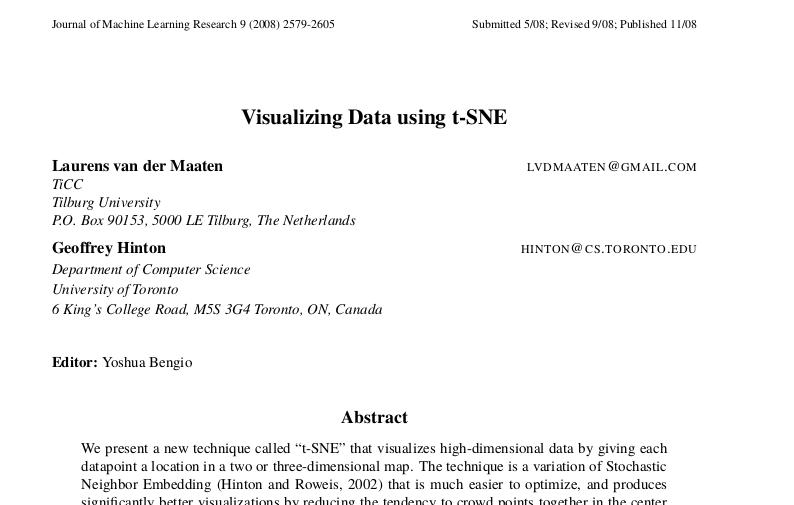

# t-SNE

## t-SNE



----------------

[t-SNE](https://en.wikipedia.org/wiki/T-distributed_stochastic_neighbor_embedding) 
is a new-er-than-PCA method for dimension reduction
(visualization of struture in high-dimensional data).

. . .

You can think about this as a lengthy exercise in
"let's dissect a sophisticated loss function for dimension reduction".

-----------------

It [makes very nice visualizations](https://distill.pub/2016/misread-tsne/).

------------

The *generic idea* is to find a low dimensional representation
(i.e., a *picture*)
in which *proximity* of points
reflects *similarity* of the corresponding (high dimensional) observations.

-------------

Suppose we have $n$ data points, $x_1, \ldots, x_n$
and each one has $p$ variables: $x_1 = (x_{11}, \ldots, x_{1p})$.

. . .

For each, we want to find a low-dimensional point $y$:
$$\begin{aligned}
    x_i \mapsto y_i
\end{aligned}$$
similarity of $x_i$ and $x_j$
is (somehow) reflected by proximity of $y_i$ and $y_j$

. . .

We need to define:

0. "low dimension" (usually, $k=2$ or $3$)
1. "similarity" of $x_i$ and $x_j$
2. "reflected by proximity" of $y_i$ and $y_j$

## Similarity

To measure similarity, we just use (Euclidean) distance:
$$\begin{aligned}
    d(x_i, x_j) = \sqrt{\sum_{\ell=1}^n (x_{i\ell} - x_{j\ell})^2} ,
\end{aligned}$$
after first normalizing variables to vary on comparable scales.


## Proximity

A natural choice is to require distances in the new space ($d(y_i, y_j)$) 
to be as close as possible to distances in the original space ($d(x_i, x_j)$).

. . .

That's a *pairwise* condition.
t-SNE instead tries to measure how faithfully
*relative distances* are represented in each point's *neighborhood*.


## Neighborhoods 

For each data point $x_i$, define 
$$\begin{aligned}
    p_{ij} = \frac{ e^{-d(x_i, x_j)^2 / (2\sigma^2)} 
                  }{ \sum_{\ell \neq i} e^{-d(x_i, x_\ell)^2 / (2 \sigma^2)} } ,
\end{aligned}$$
and $p_{ii} =  0$.

This is the probability that point $i$ would pick point $j$ as a neighbor
if these are chosen according to the Gaussian density centered at $x_i$.

--------------

*Exercise:*

1. Draw 9 points in a 10m x 10m square. Label the points 1 to 9.
2. Draw another square, and try to draw the points 1 to 9 in *that* one
   so that the neighborhood of point `1` is similar to the first picture,
   but the neighborhood of point `9` is not.

*Reminder:* the "neighborhood" is defined by relative distances:
for point $i$ it is
$$\begin{aligned}
    p_{ij} = \frac{ e^{-d(x_i, x_j)^2 / (2\sigma^2)} 
                  }{ \sum_{\ell \neq i} e^{-d(x_i, x_\ell)^2 / (2 \sigma^2)} } ,
\end{aligned}$$
and $p_{ii} =  0$.


--------------

Similarly, in the output space, define
$$\begin{aligned}
    q_{ij} = \frac{ (1 + d(y_i, y_j)^2)^{-1} 
                  }{ \sum_{\ell \neq i} (1 + d(y_i, y_\ell)^2)^{-1} }
\end{aligned}$$
and $q_{ii} =  0$.


This is the probability that point $i$ would pick point $j$ as a neighbor
if these are chosen according to the Cauchy centered at $x_i$.


## Similiarity of neighborhoods

We want neighborhoods to look similar, i.e.,
choose $y$ so that 
$q$ looks like $p$.

To do this, we minimize
$$\begin{aligned}
    \text{KL}(p \;|\; q)
    &=
    \sum_{i} \sum_{j} p_{ij} \log\left(\frac{p_{ij}}{q_{ij}}\right) .
\end{aligned}$$

. . .

*What's KL()?*

## Kullback-Leibler divergence

$$\begin{aligned}
    \text{KL}(p \;|\; q)
    &=
    \sum_{i} \sum_{j} p_{ij} \log\left(\frac{p_{ij}}{q_{ij}}\right) .
\end{aligned}$$

This is the average log-likelihood ratio between $p$ and $q$
for a single observation drawn from $p$.

It is a measure of how "surprised" you would be by a sequence of samples from $p$
that you think should be coming from $q$.


. . .

**Facts:**

1. $\text{KL}(p \;|\; q) \ge 0$

2. $\text{KL}(p \;|\; q) = 0$ only if $p_i = q_i$ for all $i$.


# Simulate data

## set-up

```{python setup}
import numpy as np
import pandas as pd
import plotnine as p9
import seaborn as sns
import scipy
import scipy.optimize
rng = np.random.default_rng(seed=123)
```

## A high-dimensional donut

Let's first make some data.
This will be some points distributed around a ellipse in $n$ dimensions.

```{python tsim_data}
n = 20
npts = 1000
xy = rng.normal(size=n*npts).reshape((npts, n))
theta = rng.uniform(size=npts) * 2 * np.pi
theta.sort()
ab = rng.normal(size=2*n).reshape((2, n))
ab[:,1] = ab[:,1] - ab[:,0] * np.sum(ab[:,0] * ab[:,1]) / np.sqrt(np.sum(ab[:,1]**2))
ab /= np.sqrt(np.sum(ab**2, axis=1))[:,np.newaxis]
for k in range(npts):
    dxy = 4 * np.array([np.cos(theta[k]), np.sin(theta[k])]).dot(ab)
    xy[k,:] += dxy
```

---------------------

Here's what the data look like:

```{python plot_data}
sns.pairplot(pd.DataFrame(xy))
```

---------------------

But there is hidden, two-dimensional structure:
```{python plot_ring}
(
    pd.DataFrame(xy.dot(ab.T), columns=('a', 'b')).reset_index()
    >>
    p9.ggplot(p9.aes(x='a', y='b', color='index')) + p9.geom_point()
)
```

# Implementation

The quantity to be minimized is Kullback-Leibler distance between $p$ and $q$,
defined as
$$\begin{aligned}
    \text{KL}(p|q) 
        &= \sum_x p_x \log(p_x/q_x) .
\end{aligned}$$


## Summary ($t$-SNE):

Given data $\{ x_i \in \mathbb{R}^n \}$,
find locations $\{ y_i \in \mathbb{R}^k \}$
to minimize 
$$\begin{aligned}
    \sum_{ij} p_{ij} \log(p_{ij} / q_{ij}) ,
\end{aligned}$$
where $p_{ij} \propto e^{-d_{ij}^2/\sigma^2}$
and $q_{ij} \propto 1/(1 + d_{ij}^2)$,
and rows in $p$ and $q$ are normalized to sum to 1.

. . .

*Observation:* you could implement $t$-SNE, with that description.

## Let's lean on `skelearn` instead:

```{python run_tsne}
import sklearn.manifold
tsne = sklearn.manifold.TSNE(n_components=2).fit_transform(xy)
```

## It works!

```{python plot_tsne}
(
    pd.DataFrame(tsne, columns=["coord1", "coord2"]).reset_index()
    >>
    p9.ggplot(p9.aes(x="coord1", y="coord2", color='index'))
    + p9.geom_point()
)
```


# Another case

## High-dimensional random walk


```{python sim_rw}
n = 40
npts = 100
rw = rng.normal(size=n*npts).reshape((npts, n))
for i in range(1, npts):
    rw[i,:] = np.sqrt(.9) * rw[i-1,:] + np.sqrt(.1) * rw[i,:]
```


--------------------------

```{python plot_rw_sub}
sns.pairplot(pd.DataFrame(rw[:,:10]))
```

## Run again

```{python run_tsne2}
rw_tsne = sklearn.manifold.TSNE(n_components=2).fit_transform(rw)
```


## It works!

```{python plot_rw_tsne}
(
    pd.DataFrame(rw_tsne, columns=["coord1", "coord2"]).reset_index()
    >>
    p9.ggplot(p9.aes(x="coord1", y="coord2", color='index'))
    + p9.geom_point()
)
```

