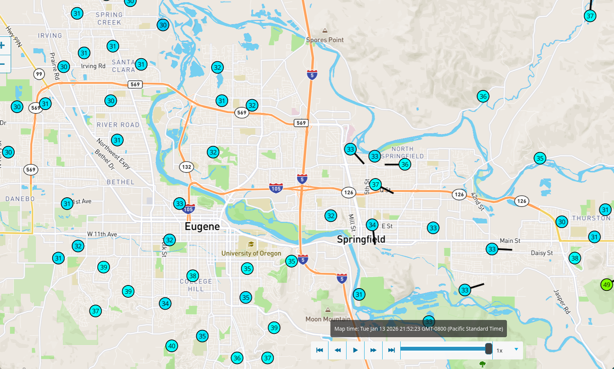
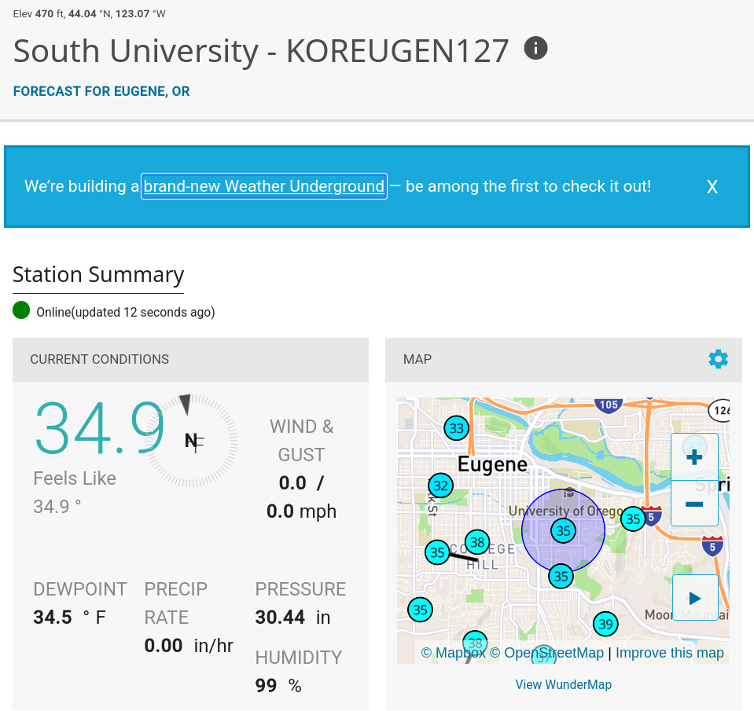
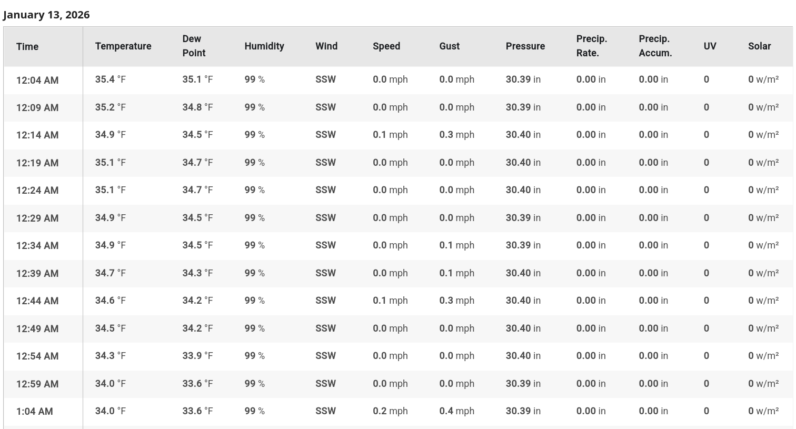

# Weather Underground

Associated with WU is a large number of [Personal Weather Stations](https://www.wunderground.com/pws/overview)

[](https://www.wunderground.com/wundermap?lat=44.058&lon=-123.105)

## 

From these, data is available:

[](https://www.wunderground.com/dashboard/pws/KOREUGEN127)

##

... every five minutes:



## Web scraping

Happily, someone has written a [scraper](https://github.com/Karlheinzniebuhr/the-weather-scraper):
```
git clone git@github.com:Karlheinzniebuhr/the-weather-scraper.git
cd the-weather-scraper
pip install lxml requests
# edit stations.txt and config.py
python weather_scraper.py
```
and then WAIT. (There's 5-second timeouts between requests.)

I've done some for you:

- a table of local stations: [stations.csv](data/stations.csv)
- a zip file of data from 2025: [weather_2025.zip](data/weather_2025.zip)

Let's have a look! *(unzip the file to `data/`)*

```{python setup}
import pandas as pd
import plotnine as p9
import glob

stations = pd.read_csv("data/stations.csv")
stations
```

Better would be with a map for background, but this is okay:

```{python plot_stations}
(
    p9.ggplot(stations, p9.aes(x="lon", y="lat", color="elev")) 
    + p9.geom_point(size=4)
    + p9.theme(aspect_ratio=1.0)
    + p9.geom_text(p9.aes(label='name'), ha='left', nudge_x=0.004)
)
```

Each station has it's own file:

```{python weather}
def read_wf(f):
    x = pd.read_csv(f).convert_dtypes()
    x['code'] = f.split("/")[-1].split(".")[0]
    return x

    
wfiles = glob.glob("data/weather_2025/*.csv")

weather = pd.concat([read_wf(f) for f in wfiles])
weather
```

## Goals:

What we'd like to do is
**understand how well rainfall in one part of Eugene/Springfield
predicts rainfall in another part**.
In particular, how well does rainfall at one point --
the [National Weather Service station](https://forecast.weather.gov/MapClick.php?lat=44.0520691&lon=-123.08675360000001) --
predict load for the municipal stormwater system?

*So:* let's understand the data, with this goal in mind.

